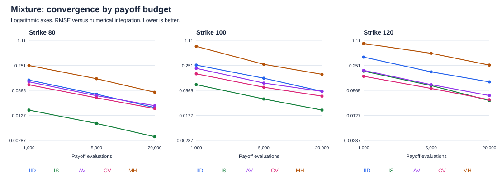

# Monte Carlo Pricing Lab

**When does variance reduction actually make an option-pricing calculation more efficient?**

This project compares five estimators for European puts under synthetic generalised-normal mixture return models. It checks simulated prices and variance against numerical integration, separates tuning from evaluation, and measures both accuracy and computational cost.

**Start here:** [technical walkthrough](docs/WALKTHROUGH.md) · [final benchmark report](results/reconstruction-v3/REPORT.md) · [experiment provenance](docs/PROVENANCE.md)



## Run a price calculation

Python 3.10+ and NumPy are the only runtime requirements. Use a virtual environment if desired, then run from the repository root:

```sh
python -m pip install .
python -m mcpricing price --scenario mixture --strike 100 --samples 20000
python -m unittest discover -s tests -v
```

The command prints price estimates, standard errors, quadrature reference, population variance constants, pilot costs and a pathwise delta estimate. The installed `mcpricing` command is equivalent to `python -m mcpricing`.

For an explained comparison with a fixed proposal:

```sh
python examples/first_experiment.py
```

## What is implemented?

| Method | Mechanism | Main issue to understand |
|---|---|---|
| IID | Direct mixture draws | Standard error decreases as the inverse square root of sample count |
| IS | Defensive, shifted-mixture importance sampling | Proposal tuning and likelihood weights cost time |
| AV | Opposite shocks within each mixture component | A pair is one independent observation, using two payoffs |
| CV | Discounted terminal stock as a control variate | Its expectation must be known; coefficient is fitted on separate samples |
| MH | Gaussian random-walk Metropolis-Hastings | Serial correlation; step is tuned by expected squared jump distance |

The mixture is sampled exactly via Gamma radii and independent signs. The terminal stock law includes an exponential-moment correction enforcing its discounted expectation. Sixteen tests cover the Black-Scholes limit, martingale and put-call identities, estimators, population variance, numerical refinement, delta, reproducibility and the end-to-end benchmark.

## What the experiments found

The final benchmark contains **13,500 estimates**: three distributions x three strikes x three payoff budgets x five pilot groups x 20 independent repeats x five methods. All evaluation draws are separate from tuning. Raw trials, candidates, seeds, source hashes and environment details are committed alongside the report.

At spot/strike 100 in the default mixture, with 20,000 payoff evaluations:

| Method | Empirical RMSE | Population variance reduction vs IID | Mean estimator time |
|---|---:|---:|---:|
| IID | 0.05346 | 1.00x | 2.59 ms |
| IS | 0.01754 | 9.40x | 6.44 ms |
| AV | 0.05334 | 1.38x | 1.53 ms |
| CV | 0.04017 | 2.41x | 2.70 ms |
| MH | 0.14755 | Not computed | 37.59 ms |

The price reference is **4.28997599**. Population variance ratios use integrated payoff moments conditional on each frozen pilot and are averaged over the five pilot groups. MH's autocovariance sum is not integrated, so it is deliberately omitted from that column. Finite-sample RMSE and theoretical variance need not rank close competitors identically.

The empirical IS variance ratio is **9.46x**, with an exploratory hierarchical-bootstrap 95% interval of **5.16-19.47x**. The population calculation is a more precise check for this specific model and proposal. A 9.40x variance reduction means approximately **3.07x lower standard error**, not 9.40x less error or a guaranteed runtime speedup.

IS's variance-times-runtime efficiency is about **3.81x** that of IID **excluding pilots**, but only **0.70x** when charging the full 28.36 ms proposal search to one estimate. Reusing a proposal changes the cost comparison. At different strikes, antithetic or control variates can be attractive without a large tuning bill.

An earlier experiment exposed a weak MH tuning objective: a rare-payoff pilot can misleadingly report low variance because it barely sees losses. The revised implementation tunes target exploration instead. Both rounds are retained; changes and limitations are explained in [provenance](docs/PROVENANCE.md).

These are model- and machine-specific findings, not trading performance claims or universal speedups.

## Reproduce or extend the benchmark

Quick smoke experiment:

```sh
python -m mcpricing benchmark --scenarios mixture --strikes 100 --sizes 1000 5000 --groups 2 --repeats 5 --pilot-samples 1000 --bootstrap 200 --output local-results
```

Full final experiment:

```sh
python -m mcpricing benchmark --output my-full-run
```

Exact tested dependency version on Python 3.12:

```sh
python -m pip install -r requirements-reproduce.txt
python -m pip install --no-deps .
```

Existing output directories are never overwritten. Each run generates `trials.csv`, `summary.csv`, `population.csv`, pilot and environment JSON, SVG figures, Markdown and a standalone HTML report. Open `report.html` in a browser to inspect the results locally.

To regenerate a report from an existing run:

```sh
python -m mcpricing report my-full-run
```

## Portability and automation

The package built and installed successfully on Windows with Python 3.12.14 and NumPy 2.3.5. All 16 local tests passed. An included GitHub Actions workflow targets Linux, Windows and macOS, with Python 3.10, 3.12 and 3.13 combinations. Those hosted jobs must pass before claiming cross-platform validation.

A Docker recipe is provided:

```sh
docker build -t mcpricing .
docker run --rm mcpricing price --samples 20000
```

Docker was unavailable in the reconstruction environment, so the recipe has not been executed there. The core program requires no GPU, service account, API key or market-data subscription.

## Model scope

This is a **single-maturity terminal pricing model**, specified directly under a synthetic pricing law. It is not inferred from historical returns, calibrated to an option surface, or presented as a consistent multi-maturity process. Shapes above one provide the exponential moments needed for the construction; the implementation deliberately limits parameters to a documented numerical range.

The one-dimensional reference integral is cheaper and more appropriate than Monte Carlo for this simple contract. Simulation is used to study estimator behaviour before extending to harder payoffs. A path-dependent extension would require a separately justified dynamic model.

MH is a teaching baseline. Starting the chain in stationarity prevents a bad initial point from distorting the comparison, but does not remove serial dependence. Batch-means intervals are approximate and occasionally under-cover. Bootstrap uncertainty estimates use only five pilot groups and are exploratory.

## Project map

| File | Purpose |
|---|---|
| `mcpricing/model.py` | Terminal law, put payoff, proposal and reference price |
| `mcpricing/estimators.py` | Five estimators and independent-pilot tuning |
| `mcpricing/theory.py` | Integrated variance constants and reference delta |
| `mcpricing/quadrature.py` | Gauss-Legendre rule and tail truncation helpers |
| `mcpricing/benchmark.py` | Repeated experiments, timing and bootstrap intervals |
| `mcpricing/report.py` | Markdown, HTML and SVG reports |
| `tests/` | Numerical and statistical checks |
| `docs/WALKTHROUGH.md` | Derivations, code-reading guide and exercises |

This is a fresh reconstruction of a lost student project, with AI implementation assistance. All measurements are from the reconstructed code. See [CONTRIBUTING.md](CONTRIBUTING.md) for how to design and record an extension.
