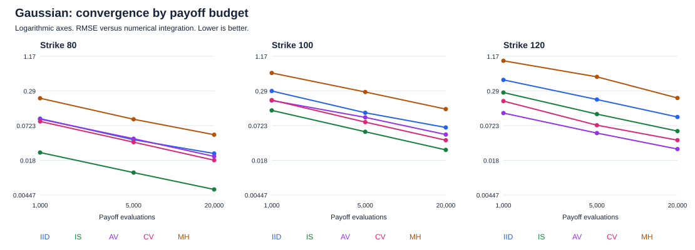
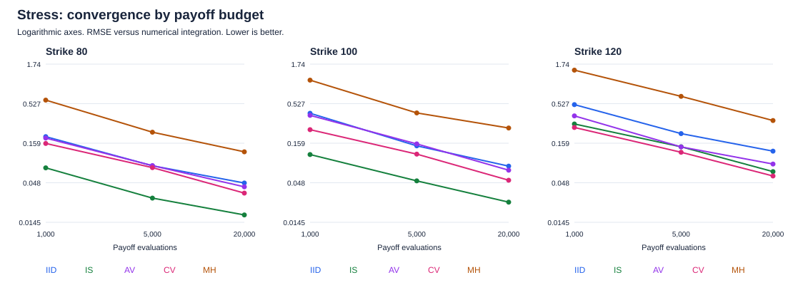

# Benchmark report

13,500 estimates across 3 synthetic distributions, 3 strikes and 3 payoff budgets. 5 independent pilot groups and 20 held-out repeats per group. Tables below use 20,000 payoff evaluations per estimate.

These are synthetic pricing experiments, not trading returns or market-calibrated results. Each proposal and control coefficient is fitted on separate pilot samples. The original 6.1x figure came from a smaller experiment; this report evaluates the whole tuning procedure.

## Gaussian



| Strike | Method | RMSE | Empirical VRF (95% interval) | Population VRF | Coverage | Runtime ms | Pilot ms | Efficiency incl. pilot |
| --- | --- | --- | --- | --- | --- | --- | --- | --- |
| 80 | IID | 0.02364 | 1.00 (1.00-1.00) | 1.00 | 95% | 2.38 | 0.00 | 1.00 |
| 80 | IS | 0.00559 | 17.95 (11.08-29.53) | 15.28 | 95% | 5.15 | 22.91 | 1.52 |
| 80 | AV | 0.02103 | 1.26 (0.83-1.94) | 1.09 | 93% | 1.42 | 0.00 | 2.11 |
| 80 | CV | 0.01806 | 1.72 (1.09-2.67) | 1.29 | 96% | 2.49 | 0.93 | 1.20 |
| 80 | MH | 0.05021 | 0.22 (0.14-0.35) | N/A | 91% | 35.80 | 93.51 | 0.00 |
| 100 | IID | 0.06707 | 1.00 (1.00-1.00) | 1.00 | 95% | 2.43 | 0.00 | 1.00 |
| 100 | IS | 0.02731 | 5.85 (3.41-9.35) | 5.55 | 96% | 5.25 | 24.47 | 0.48 |
| 100 | AV | 0.05052 | 1.70 (0.81-3.44) | 1.91 | 95% | 1.50 | 0.00 | 2.75 |
| 100 | CV | 0.04023 | 2.72 (1.53-4.87) | 2.60 | 94% | 2.58 | 0.98 | 1.85 |
| 100 | MH | 0.14016 | 0.22 (0.11-0.43) | N/A | 97% | 36.32 | 94.27 | 0.00 |
| 120 | IID | 0.10220 | 1.00 (1.00-1.00) | 1.00 | 97% | 2.49 | 0.00 | 1.00 |
| 120 | IS | 0.05802 | 3.09 (2.05-4.63) | 3.47 | 96% | 5.24 | 23.43 | 0.27 |
| 120 | AV | 0.02824 | 13.06 (8.49-22.63) | 18.00 | 93% | 1.49 | 0.00 | 21.83 |
| 120 | CV | 0.04033 | 6.42 (4.16-10.42) | 7.79 | 91% | 2.58 | 1.02 | 4.44 |
| 120 | MH | 0.21887 | 0.22 (0.14-0.34) | N/A | 97% | 36.87 | 94.82 | 0.00 |

## Mixture


| Strike | Method | RMSE | Empirical VRF (95% interval) | Population VRF | Coverage | Runtime ms | Pilot ms | Efficiency incl. pilot |
| --- | --- | --- | --- | --- | --- | --- | --- | --- |
| 80 | IID | 0.02034 | 1.00 (1.00-1.00) | 1.00 | 97% | 2.44 | 0.00 | 1.00 |
| 80 | IS | 0.00358 | 30.80 (19.07-48.66) | 33.00 | 98% | 6.29 | 27.62 | 2.21 |
| 80 | AV | 0.02270 | 0.81 (0.53-1.27) | 1.03 | 93% | 1.47 | 0.00 | 1.34 |
| 80 | CV | 0.01919 | 1.07 (0.60-1.80) | 1.28 | 96% | 2.59 | 0.95 | 0.74 |
| 80 | MH | 0.05062 | 0.16 (0.10-0.25) | N/A | 96% | 37.14 | 93.97 | 0.00 |
| 100 | IID | 0.05346 | 1.00 (1.00-1.00) | 1.00 | 95% | 2.59 | 0.00 | 1.00 |
| 100 | IS | 0.01754 | 9.46 (5.16-19.47) | 9.40 | 96% | 6.44 | 28.36 | 0.70 |
| 100 | AV | 0.05334 | 1.01 (0.57-2.03) | 1.38 | 93% | 1.53 | 0.00 | 1.72 |
| 100 | CV | 0.04017 | 1.80 (1.09-2.94) | 2.41 | 94% | 2.70 | 1.09 | 1.23 |
| 100 | MH | 0.14755 | 0.13 (0.08-0.22) | N/A | 95% | 37.59 | 99.58 | 0.00 |
| 120 | IID | 0.09409 | 1.00 (1.00-1.00) | 1.00 | 94% | 2.40 | 0.00 | 1.00 |
| 120 | IS | 0.03086 | 9.02 (4.77-17.24) | 5.20 | 99% | 6.16 | 30.00 | 0.60 |
| 120 | AV | 0.04162 | 4.96 (2.53-8.51) | 4.80 | 96% | 1.44 | 0.00 | 8.28 |
| 120 | CV | 0.03249 | 8.14 (4.37-13.98) | 7.99 | 92% | 2.52 | 1.03 | 5.51 |
| 120 | MH | 0.25623 | 0.13 (0.07-0.27) | N/A | 92% | 36.99 | 104.85 | 0.00 |

## Stress



| Strike | Method | RMSE | Empirical VRF (95% interval) | Population VRF | Coverage | Runtime ms | Pilot ms | Efficiency incl. pilot |
| --- | --- | --- | --- | --- | --- | --- | --- | --- |
| 80 | IID | 0.04763 | 1.00 (1.00-1.00) | 1.00 | 94% | 2.31 | 0.00 | 1.00 |
| 80 | IS | 0.01811 | 6.98 (4.37-11.45) | 6.97 | 91% | 6.21 | 28.65 | 0.46 |
| 80 | AV | 0.04243 | 1.25 (0.78-2.02) | 1.08 | 96% | 1.37 | 0.00 | 2.11 |
| 80 | CV | 0.03508 | 1.83 (0.99-3.68) | 1.50 | 96% | 2.43 | 0.97 | 1.24 |
| 80 | MH | 0.12250 | 0.15 (0.09-0.25) | N/A | 95% | 36.15 | 96.38 | 0.00 |
| 100 | IID | 0.07941 | 1.00 (1.00-1.00) | 1.00 | 95% | 2.39 | 0.00 | 1.00 |
| 100 | IS | 0.02667 | 8.71 (4.36-18.45) | 10.18 | 95% | 6.07 | 27.85 | 0.61 |
| 100 | AV | 0.07021 | 1.36 (0.66-2.39) | 1.23 | 96% | 1.48 | 0.00 | 2.21 |
| 100 | CV | 0.05179 | 2.36 (1.30-4.17) | 2.10 | 97% | 2.54 | 1.03 | 1.58 |
| 100 | MH | 0.25205 | 0.10 (0.05-0.16) | N/A | 90% | 36.24 | 94.20 | 0.00 |
| 120 | IID | 0.12500 | 1.00 (1.00-1.00) | 1.00 | 95% | 2.38 | 0.00 | 1.00 |
| 120 | IS | 0.06726 | 3.46 (2.16-5.41) | 2.97 | 96% | 6.09 | 28.44 | 0.24 |
| 120 | AV | 0.08460 | 2.23 (1.08-4.23) | 2.16 | 92% | 1.45 | 0.00 | 3.65 |
| 120 | CV | 0.05891 | 4.52 (2.77-7.17) | 3.62 | 96% | 2.52 | 0.97 | 3.09 |
| 120 | MH | 0.31609 | 0.16 (0.08-0.27) | N/A | 93% | 35.83 | 94.95 | 0.00 |

## Reading the results

- VRF = IID estimator variance / method estimator variance at the same payoff budget. Above 1 means lower variance. AV uses half as many independent pair averages, with two payoffs per pair.
- Population VRF is obtained by integrating payoff moments under the model, averaged over the frozen pilot choices. It checks the empirical comparison without relying on another finite set of Monte Carlo estimates. MH has no population VRF here because its serial autocovariances are not integrated.
- Bootstrap intervals resample pilot groups and held-out repeats. Five pilot groups still give limited evidence about tuning variability; the intervals are exploratory, not simultaneous confidence bands over the grid.
- Coverage is the observed fraction of nominal 95% intervals containing the reference. It has sampling uncertainty. MH uses batch means; IID formulas must not be used on correlated chain draws.
- Efficiency incl. pilot = (IID variance x IID runtime) / (method variance x (runtime + one full method-specific pilot)). Above 1 is better. This is a variance-times-cost comparison, not an observed speedup at equal RMSE. Reusing a pilot amortises its cost; per-call figures excluding pilots are in summary.csv.
- Pilot time includes all 12 IS candidate trials, all six MH step trials, or the CV coefficient fit, respectively. MH steps maximise expected squared jump distance, avoiding a rare-payoff pilot being mistaken for a low-variance chain. Shared quadrature, imports and report writing are excluded from estimator timing. IS weight ESS and MH payoff ESS are different diagnostics and should not be directly compared.
- The benchmark samples a one-maturity terminal law. No calibrated volatility surface, dynamic hedging, transaction costs or realised trading profit is claimed. Quadrature is the practical preferred solver for this simple one-dimensional contract.
- Antithetic sampling is performed within each mixture component. Between-component randomness can outweigh the within-component negative covariance, so it is not guaranteed to beat IID for these mixtures.
- Hardware timing is machine-specific and sub-millisecond measurements are noisy. The code stores source hashes, random seeds, parameters, raw trials and environment information. Reordering or selecting a subset of scenarios leaves their random streams unchanged.

## Reproduce

```sh
python -m mcpricing benchmark --output local-results
```

Use the exact arguments in metadata.json for non-default runs. Existing result directories are never overwritten.
